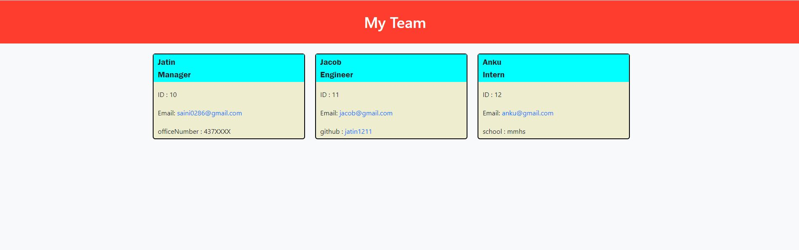

# Team-Profile-Generator
A command-line application that takes in information about employees on a software engineering team and generates an HTML webpage that displays summaries for each person.

## Description
The application allows user to enter inputs and add Manager,Engineer and Interns to their team.
The user can enter a variety of data with the provided prompts.
User can have access to mail function and link to the Github repo directly from the HTML webpage generated by the code.

## User story
### As a Manager:
I WANT to generate a webpage that displays my team's basic info

### So that:
I have quick access to their emails and GitHub profiles

## Table of Contents
* [Installation](#installation)
* [Usage](#usage)
* [Technologies used](#technologies-used)
* [License](#license)
* [Contribution](#contribution)
* [Screenshot](#screenshot)
* [Walkthrough video](#walkthrough-video)
* [Questions](#questions)

## Installation
Please clone the repo to your local machine and do `npm i` to download the following packages:
* "inquirer": "^8.2.4",
* "jest": "^29.0.2"

## Usage
* WHEN I am prompted for my team members and their information,
THEN an HTML file is generated that displays a nicely formatted team roster based on user input
* WHEN I click on an email address in the HTML,
THEN my default email program opens and populates the TO field of the email with the address
* WHEN I click on the GitHub username,
THEN that GitHub profile opens in a new tab
* WHEN I start the application,
THEN I am prompted to enter the team manager’s name, employee ID, email address, and office number
* WHEN I enter the team manager’s name, employee ID, email address, and office number,
THEN I am presented with a menu with the option to add an engineer or an intern or to finish building my team
* WHEN I select the engineer option,
THEN I am prompted to enter the engineer’s name, ID, email, and GitHub username, and I am taken back to the menu
* WHEN I select the intern option,
THEN I am prompted to enter the intern’s name, ID, email, and school, and I am taken back to the menu
* WHEN I decide to finish building my team,
THEN I exit the application, and the HTML is generated

## Technologies used

## License

## Contribution
- [Jatin Saini](https://github.com/jatin1211)

## Screenshot

## Walkthrough video
https://drive.google.com/file/d/1-WzrhUVlazdhQo0qD8qohbPfpz2E5FuH/view

## Questions
Please email me with questions!
* sainijatin247@gmail.com
